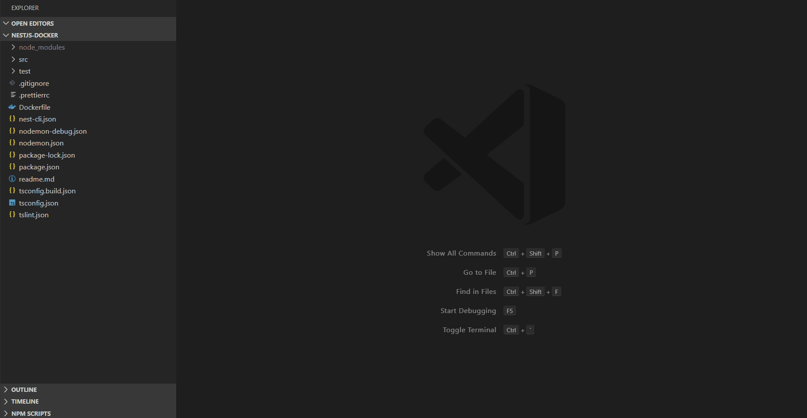

# NPM Audit

VS Code extension to visualize **npm audit reports**  
The extensions runs the npm audit command and presents the result in a readable format !

## Features

Right click on **package-lock.json** in your current project. If you don't have one then generate one first using command `npm i --package-lock-only`

Menu Options  |
---           | 
NPM Audit|

## Installation

1. Install Visual Studio Code 1.40.0 or higher
2. Launch Code
3. From the command palette `Ctrl`-`Shift`-`P` (Windows, Linux) or `Cmd`-`Shift`-`P` (OSX)
4. Select `Install Extension`
5. Type `NPM Audit` and press enter
6. Install

# License

MIT
